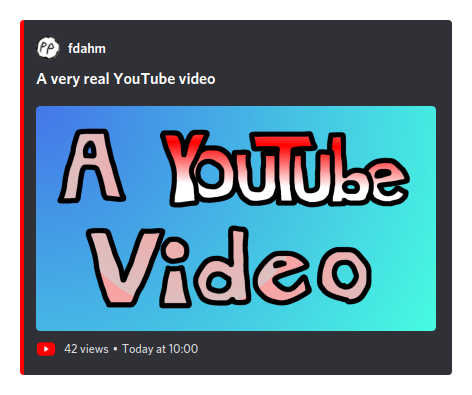

# fdahm

_a.k.a._ **F**uturistic **D**iscord not **A**utomated **H** bot that **M**akes cards with fake youtube videos

## What ?

A simple command line-based "short-living"<sup>*</sup> Discord bot that posts Discord embeds (=cards) supposed to represent YouTube videos (that actually don't exist).

<sub><sup>*</sup>This bot doesn't run in the background. You invoke it as a CLI, it does its business and disconnects.</sub>



## Why ?

The use cases are rather limited, yup.

## How ?

### CLI

**fdahm** is CLI-based and needs its own working directory, where config files and fake videos are stored. Regarding its actual usage, here's what you're being told (as of 0508b6682d9b912907e3a8960dad6a487205bcde) if you ask for help (or mess up):

```
fdahm 
Edgar Onghena <dev@edgar.bzh>

USAGE:
    fdahm <SUBCOMMAND>

FLAGS:
    -h, --help       Prints help information
    -V, --version    Prints version information

SUBCOMMANDS:
    help       Prints this message or the help of the given subcommand(s)
    list       List "videos" in the current directory
    login      Store a discord token in the OS's keyring
    new        Create a new video directory with a default `video.toml`
    publish    Publish a "video" to Discord and mark it as published
```

_(this amazing help message is provided by [`clap`](https://github.com/clap-rs/clap))_

I let you discover each command with trial and error. Appending `--help` to any sub-command displays a specific help message.

### Working directory structure

```
.
└── my_fdahm_directory/
    ├── my_first_video/
    │   ├── thumbnail.jpg
    │   └── video.toml
    ├── another_nice_one/
    │   ├── thumbnail.png
    │   └── video.toml
    └── fdahm.toml
```

*`video.toml`*:

```toml
title = "A very real YouTube video"
views = 42

# Automatically added when publishing. Prevents publishing again accidentally
#published = true
```

*`fdahm.toml`*:

```toml
# In which channel will videos be published. The bot must be added to the
# Discord server where this channel is, obviously
channel_id = 435474546305269763
name = "fdahm"
pp_url = "https://discord.com/assets/28174a34e77bb5e5310ced9f95cb480b.png"
```

## License

A simple [AGPL-3.0](LICENSE).
